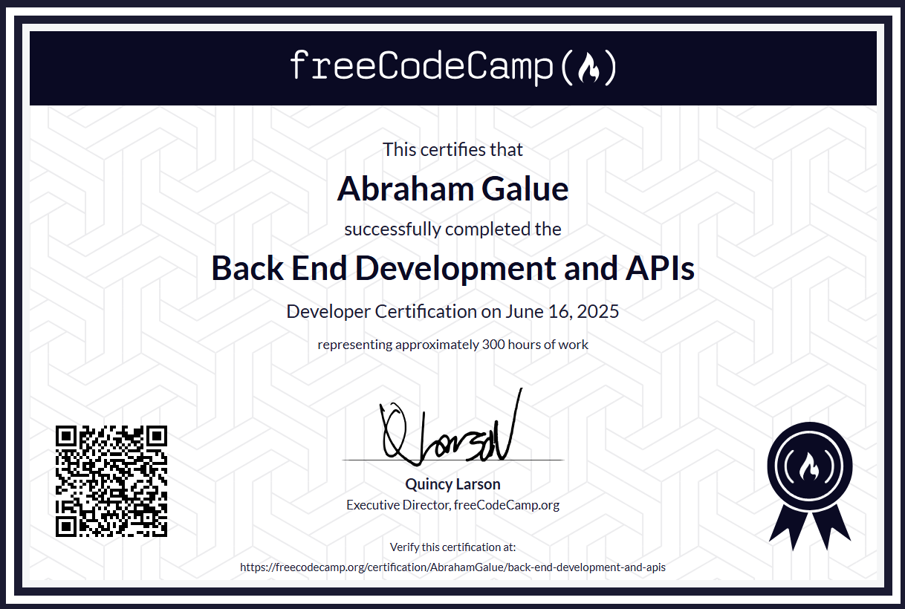

# 🔥 freeCodeCamp: Back End Development and APIs

### Certificado de freeCodeCamp

> 🗝 Puedes verificar aquí la veracidad de mi [**certificado**](https://www.freecodecamp.org/certification/AbrahamGalue/back-end-development-and-apis).

## 🚀 Descripción

Este es mi repositorio de proyectos con los cuales conseguí la **certificación de freeCodeCamp** en su curso de Desarrollo Backend y APIs, usando **Express.js** y **MongoDB**. Espero que te pueda ayudar.

## 🎭 Proyectos

Los **proyectos principales** para obtener el certificado y que se incluyen son:

- Timestamp Microservice
- Request Header Parser Microservice
- URL Shortener Microservice
- Exercise Tracker
- File Metadata Microservice
